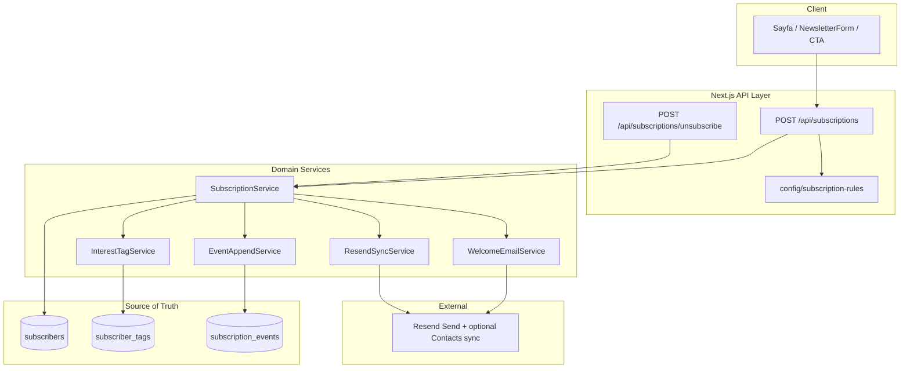

# 01 — Architecture

**Proje:** Ofis Akademi — Newsletter v2 / Interest-Based Subscription  
**Durum:** v1.0 Final — **dondurulmuş sözleşme**  
**Sapma kuralı:** Kod ≠ doküman ise önce doküman, sonra kod.

---

## 1. Amaç

Newsletter v2, e-posta listesi yönetiminin ötesinde bir **ilgi alanı altyapısıdır**.

- Kullanıcı anonim gezebilir; üyelik zorunlu değildir.
- Mail bırakıldığı anda ilgi alanı sınıflandırılır.
- Ofis Akademi veritabanı **source of truth**’tur.
- Resend yalnızca **gönderim katmanı**dır.
- Mimari ileride profil, favori, CRM ve interest score’a genişleyebilir; MVP’de bunlar yok.
- **Business logic yalnızca Domain katmanında bulunur** (API ince; UI kural içermez).

---

## 2. Mevcut durum (as-is)

| Bileşen | Bugün |
|---------|--------|
| Abonelik API | `POST /api/abone` |
| Kalıcı store | Yok (Resend Contacts + log) |
| Source | Kısa string (`body.source`), max 64 char |
| Welcome | Tek şablon (Excel odaklı) |
| Tag / kategori | Yok |
| Event geçmişi | Yok |

Bu mimari, mevcut `/api/abone` akışını **genişleterek** (veya `v2` altında yeniden konumlandırarak) OA DB + event modeline taşır.

---

## 3. Hedef mimari (to-be)

---

## 4. Katmanlar ve sorumluluklar

### 4.1 Presentation (UI)

- E-posta + `reason` + `channel` (+ isteğe bağlı `session_id`) gönderir.
- **Category / tag göndermez**; iş kuralı uygulamaz.
- `page` (pathname), `referrer`, UTM client veya `Request`’ten.

### 4.2 API (Next.js Route Handlers)

- Validation, rate limit, transport mapping.
- Path → category için config’i **Domain’e parametre olarak** veya Domain içinden okutur; tag union / welcome kararı API’de yazılmaz.
- Domain servisleri çağırır; DB/Resend detayını UI’ya sızdırmaz.

### 4.3 Domain

| Servis | Sorumluluk |
|--------|------------|
| `SubscriptionService` | Upsert aggregate, orkestrasyon, outcome, welcome kararı |
| `InterestTagService` | `subscriber_tags` union; whitelist; legacy |
| `EventAppendService` | Append-only yazım |
| `WelcomeEmailService` | Yalnızca ilk SUBSCRIBE + kategori şablonu |
| `ResendSyncService` | Best-effort; hata OA kaydını rollback etmez |

**Kural:** Tag birleştirme, event tipi seçimi, welcome/sessiz, already_subscribed — hepsi Domain’de.

### 4.4 Persistence

- Relational DB (öneri: **Vercel Postgres / Neon**).
- `subscribers` + `subscriber_tags` + `subscription_events` (detay: `02_DATABASE_DESIGN.md`).

### 4.5 Email provider

- Resend: transactional welcome + ileride kampanya.
- Audience/tag sync **opsiyonel aynalama**; gönderim listesi OA’dan türetilir.

---

## 5. Ana akışlar

### 5.1 İlk abonelik (SUBSCRIBE)

1. Client `POST` email + page + reason (+ UTM/referrer).
2. API path → `primary_category` (config).
3. DB transaction:
   - `subscribers` yoksa oluştur.
   - `subscriber_tags` ← category (ON CONFLICT DO NOTHING).
   - `subscription_events` ← `SUBSCRIBE` / `RESUBSCRIBE` / `TAG_ADDED`.
4. Commit sonrası:
   - Yeni kullanıcı → kategori welcome (Resend).
   - Mevcut + yeni tag → **sessiz** (ikinci welcome yok).
5. Resend contact sync best-effort.

### 5.2 Aynı email, yeni kategori (TAG_ADDED)

1. Aggregate tags: `old ∪ {new}`.
2. Event: `TAG_ADDED` (+ gerekirse `RESUBSCRIBE` aynı request’te mi? → **hayır**; tek request’te bir birincil event + gerekirse ayrı TAG_ADDED — detay product: `05`).
3. Welcome yok.

### 5.3 Global unsubscribe (UNSUBSCRIBE)

1. Aggregate `status=unsubscribed`, `unsubscribed_at`.
2. Event `UNSUBSCRIBE`.
3. Resend: unsubscribed / listeden çıkar (best-effort).
4. Tag’ler silinmez (geçmiş ve yeniden abonelik için korunur).

### 5.4 Legacy migration (bir kerelik)

1. Resend / export’tan email listesi.
2. Her satır: `subscribers` (`tags=['legacy']`, `status=active`).
3. Event: `SUBSCRIBE` reason=`manual` veya `migration`, category=`legacy`.
4. Script bir kez; tekrar çalıştırma idempotent (email unique).

---

## 6. Config-driven kategori

Tek kaynak: örn. `lib/subscription/rules.ts` veya `config/subscription-rules.ts`.

- Path prefix → tag.
- Bilinmeyen path → mümkünse en spesifik fallback; `general` son çare.
- UI kategori seçemez / override edemez (admin tool hariç, ileride).

---

## 7. Güvenlik ve gizlilik (MVP iskeleti)

- E-posta normalize: trim + lowercase.
- Rate limit: IP + email.
- Unsubscribe token (signed) ileride mail footer’da; MVP’de basit signed link tasarımı dokümante edilir.
- KVKK: gizlilik metni “ilgi alanı / event” işlemeyi kapsayacak şekilde güncellenir (implementasyon sprint’inde).

---

## 8. Gözlemlenebilirlik

- Structured log: `subscriber_id`, `event_type`, `category`, `resend_ok`.
- Metrik (ileride): subscribe/day by category, tag cardinality, welcome failure rate.

---

## 9. Bilinçli olmayanlar (out of scope MVP)

- Kullanıcı hesabı / şifre
- Interest score hesaplama
- Favori / takip / kaydedilen dashboard
- Segment kampanya UI
- Kategori bazlı unsubscribe

---

## 10. İlgili dokümanlar

| Dosya | İçerik |
|-------|--------|
| `02_DATABASE_DESIGN.md` | Şema |
| `03_API_DESIGN.md` | HTTP sözleşmesi |
| `04_IMPLEMENTATION_PLAN.md` | Sprint’ler |
| `05_PRODUCT_DECISIONS.md` | Neden’ler |
