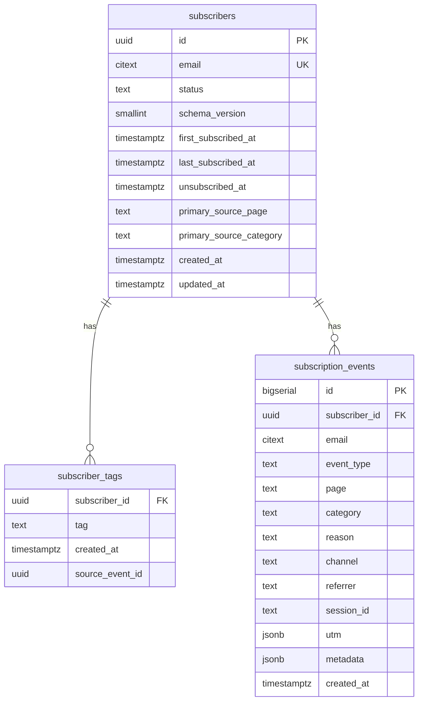

# 02 — Database Design

**Proje:** Ofis Akademi — Newsletter v2  
**Durum:** v1.0 Final — dondurulmuş  
**Sapma kuralı:** Önce doküman, sonra kod.

---

## 1. Tasarım özeti

Üç ana tablo:

| Tablo | Rol |
|-------|-----|
| `subscribers` | Aggregate — kullanıcının **güncel** durumu (status, tarihler, ilk kaynak) |
| `subscriber_tags` | Aggregate ilgi alanları — **junction** (set semantiği) |
| `subscription_events` | Append-only — **tüm** davranış geçmişi |

İleride `user_profiles`, `favorites`, `interest_scores` → `subscribers.id` üzerinden; MVP’de yok.

---

## 2. Tag saklama: JSONB vs junction — değerlendirme

### Seçenek A — `subscribers.interest_tags jsonb`

| Artı | Eksi |
|------|------|
| Tek satır okuma basit | Tag bazlı “kimler TSB?” GIN + uygulama disiplini |
| Migration az tablo | Tag başına metadata (`first_added_at`, source) zor |
| MVP için hızlı | FK / whitelist DB’de zayıf (check veya app) |
| | Interest score / favori ile birleşince yine normalize gerekir |

### Seçenek B — `subscriber_tags` junction

| Artı | Eksi |
|------|------|
| `(subscriber_id, tag)` UNIQUE = doğal set | Join (ucuz; tag cardinality düşük) |
| `WHERE tag = 'tsb'` index net | Bir insert daha (transaction içinde) |
| Tag başına `created_at` / `source_event_id` açılır | |
| İleride `interest_scores(subscriber_id, tag)` ile hizalı | |
| Whitelist enum/check kolay | |

### Ölçek bağlamı

~35 → binlerce abone, tag sayısı &lt; 20. Join maliyeti önemsiz; uzun vadeli CRM / skor / segment sorguları junction’a doğal oturur.

### Son karar (v1.0 Final)

**`subscriber_tags` junction kullanılır.**  
`interest_tags jsonb` **kullanılmaz** (denormalize cache de MVP’de yok — tek source of truth junction).

Aggregate “tags” okuması: `SELECT tag FROM subscriber_tags WHERE subscriber_id = ?`.

---

## 3. ER (mantıksal)



---

## 4. Tablo: `subscribers`

| Kolon | Tip | Zorunlu | Açıklama |
|-------|-----|---------|----------|
| `id` | `uuid` | PK | `gen_random_uuid()` |
| `email` | `citext` | UK | trim + lower |
| `status` | `text` | ✓ | `active` \| `unsubscribed` \| `bounced` \| `complained` |
| `schema_version` | `smallint` | ✓ | Default `1` — satır şekli / backfill işareti |
| `first_subscribed_at` | `timestamptz` | ✓ | |
| `last_subscribed_at` | `timestamptz` | ✓ | |
| `unsubscribed_at` | `timestamptz` | | |
| `primary_source_page` | `text` | | İlk abonelik sayfası |
| `primary_source_category` | `text` | | İlk kategori (welcome) |
| `created_at` | `timestamptz` | ✓ | |
| `updated_at` | `timestamptz` | ✓ | |

### `schema_version` değerlendirmesi

| Artı | Eksi |
|------|------|
| Backfill / “eski satır” ayrımı ucuz | İki tablo + migration ile çoğu değişim zaten versionlanır |
| CRM alanları eklenince okuyucu bilmezlikten kurtulur | Yanlış kullanılırsa drift |

**Karar:** Kolon **eklenir**, default `1`. Uzun vadede fayda maliyeti aşar; zorunlu kompleks logic yok.

### Status geçişleri

```
(yok) --SUBSCRIBE--> active
active --UNSUBSCRIBE--> unsubscribed
unsubscribed --RESUBSCRIBE--> active
active --provider--> bounced | complained  (ileride)
```

---

## 5. Tablo: `subscriber_tags`

| Kolon | Tip | Zorunlu | Açıklama |
|-------|-----|---------|----------|
| `subscriber_id` | `uuid` | PK/FK | → subscribers |
| `tag` | `text` | PK | Whitelist |
| `created_at` | `timestamptz` | ✓ | Tag’in aggregate’e ilk eklenişi |
| `source_event_id` | `bigint` | | İsteğe bağlı → `subscription_events.id` (hangi event ekledi) |

**PK:** `(subscriber_id, tag)`  
**Whitelist:** `excel` | `training` | `finance` | `insurance` | `tsb` | `ifrs17` | `legacy` | `general`  
**Yazım:** INSERT … ON CONFLICT DO NOTHING (union; silme yok — unsub tag silmez).

`legacy` migration ile gelir; sonradan eklenen tag’ler `legacy`’yi silmez.

---

## 6. Tablo: `subscription_events`

| Kolon | Tip | Zorunlu | Açıklama |
|-------|-----|---------|----------|
| `id` | `bigserial` | PK | |
| `subscriber_id` | `uuid` | FK | |
| `email` | `citext` | ✓ | Snapshot |
| `event_type` | `text` | ✓ | Enum aşağıda |
| `page` | `text` | | pathname |
| `category` | `text` | | Mapping tag |
| `reason` | `text` | | Intent / CTA nedeni |
| `channel` | `text` | | Yüzey / yerleşim |
| `referrer` | `text` | | |
| `session_id` | `text` | | Opsiyonel anonim oturum (aşağıda) |
| `utm` | `jsonb` | | |
| `metadata` | `jsonb` | | ua, ip_hash, template_id, … |
| `created_at` | `timestamptz` | ✓ | Update yok |

### Event types

| `event_type` | Ne zaman |
|--------------|----------|
| `SUBSCRIBE` | İlk kayıt |
| `RESUBSCRIBE` | unsubscribed → active |
| `TAG_ADDED` | Yeni tag junction’a eklendi |
| `UNSUBSCRIBE` | Global çıkış |

Aynı request’te resubscribe + yeni tag → **iki satır**.

### `reason` vs `channel` ayrımı

| Alan | Soru | Örnekler |
|------|------|----------|
| `reason` | **Neden** kayıt oldu? (niyet / bağlam) | `signup_form`, `download_template`, `exit_intent`, `manual`, `migration` |
| `channel` | **Nereden** UI yüzeyi? (yerleşim) | `web_inline`, `web_footer`, `web_popup`, `web_home_hero`, `email_footer` |

**Karar:** İkisi **ayrı kolon**. Tek `reason` içinde ikisini karıştırmak segmentasyon ve raporlamayı bozar  
(`download_template` hem footer hem popup’ta olabilir).

### `session_id` değerlendirmesi

| Artı | Eksi |
|------|------|
| Aynı oturumda birden fazla CTA birleştirilebilir | Anonim cookie yönetimi, consent |
| Funnel / attribution güçlenir | MVP’de zorunlu değil; boş gelecek |
| | PII-adjacent tracking yüzeyi |

**Karar (v1.0 Final):** Kolon **şemada var, nullable**. Client göndermezse `NULL`. MVP’de cookie session zorunlu değil; ileride anonim `oa_sid` eklenebilir. Zorunlu iş kuralı yok.

### Reason whitelist (örnek)

`signup_form` | `download_template` | `exit_intent` | `manual` | `migration`

### Channel whitelist (örnek)

`web_inline` | `web_footer` | `web_popup` | `web_home_hero` | `email_footer` | `unknown`

---

## 7. Index önerileri

```sql
-- subscribers
UNIQUE (email)
CREATE INDEX idx_subscribers_status ON subscribers (status);
CREATE INDEX idx_subscribers_last_subscribed ON subscribers (last_subscribed_at DESC);

-- subscriber_tags
PRIMARY KEY (subscriber_id, tag)
CREATE INDEX idx_subscriber_tags_tag ON subscriber_tags (tag);

-- subscription_events
CREATE INDEX idx_events_subscriber_created ON subscription_events (subscriber_id, created_at DESC);
CREATE INDEX idx_events_email_created ON subscription_events (email, created_at DESC);
CREATE INDEX idx_events_type_created ON subscription_events (event_type, created_at DESC);
CREATE INDEX idx_events_category ON subscription_events (category) WHERE category IS NOT NULL;
CREATE INDEX idx_events_channel ON subscription_events (channel) WHERE channel IS NOT NULL;
CREATE INDEX idx_events_session ON subscription_events (session_id) WHERE session_id IS NOT NULL;
```

---

## 8. Constraint / integrity

- `subscribers.email` UNIQUE.
- `subscription_events` / `subscriber_tags`: ON DELETE **RESTRICT** (geçmiş ve tag seti korunur; status soft).
- Event: uygulama `UPDATE`/`DELETE` yapmaz.
- Tag insert: conflict = no-op.

---

## 9. Future-ready (şimdi yok)

| Gelecek | Bağlantı |
|---------|----------|
| `user_profiles` | `subscriber_id` |
| `favorites` | `subscriber_id` + entity |
| `interest_scores` | `subscriber_id` + `tag` + score — junction ile aynı grain |

---

## 10. Migration notları

1. DDL: üç tablo.  
2. Legacy: subscriber + `subscriber_tags(legacy)` + event `SUBSCRIBE`/`migration`.  
3. Cutover sonrası OA DB otorite.
